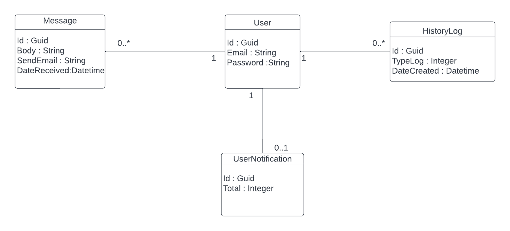

# messages-task

## Project setup API

 appsettings.json --> just change the connection string to your SQL server database.
 
 exemple :
 "MAIN": "server=DESKTOP-FHOV0U7\\SQLEXPRESS;database=MessagesTask;Integrated Security=True;TrustServerCertificate=True;"
 
 The database will be created automatically. Then, lunch both application at startup.
 
 That all.
 
 ## Project setup Vue (Nodejs required)
 
 npm install
 and
 npm run serve

 ## UML
 
  ## Difficulties
  
  with unit test in Vue js and with authentication and security aspects (API)
 
